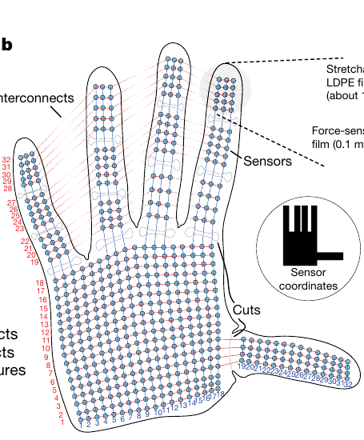

# Learning the signatures of the human grasp using a scalable tactile glove

## 文献信息

- 作者：Subramanian Sundaram, Petr Kellnhofer, Yunzhu Li, Jun-Yan Zhu, Antonio Torralba, Wojciech Matusik
- 期刊：*Nature*, 569, 698-702, 2019
- DOI：10.1038/s41586-019-1234-z
- 原文：[stag_raw_papers41586-019-1234-z.pdf](stag_raw_papers41586-019-1234-z.pdf)

本文档汇总论文阅读过程中的重点注释，并针对后续使用 **Lift and hold（提起并稳定持握）阶段触觉数据进行物体识别** 的计划给出数据选择建议。

## Annotation 1：研究问题

视觉机器人已经受益于大规模图像数据和深度学习，但机器人触觉研究仍受到两个基础问题限制：

1. 缺少能够覆盖整只手、柔软、高密度且不明显干扰手部运动的触觉传感设备；
2. 缺少大规模、全手覆盖的人类自然抓握触觉数据集。

论文希望解决的核心问题是：能否用一种低成本、可扩展的全手触觉手套记录自然抓握，并从触觉压力图中学习物体身份、重量以及不同手部区域之间的抓握协同关系。

作者提出的 STAG（Scalable Tactile Glove）不仅是一只手套，也是一套包含传感器制造、信号读取、数据采集、数据过滤和机器学习分析的完整平台。

## Annotation 2：手套性能指标

| 指标 | 论文报告值 |
|---|---:|
| 有效触觉传感单元 | 548 |
| 数据矩阵尺寸 | 32 × 32 |
| 平均采样率 | 约 7.3 帧/秒 |
| 推荐工作范围 | 30 mN - 0.5 N |
| 最低可感知法向力 | 约 20-25 mN |
| 饱和范围 | 约 0.8 N 以上 |
| 压力量化 | 约 150 个等级 |
| 峰值迟滞 | 约 17.5%，单器件测试为 17.5 ± 2.8% |
| 循环测试 | 1,000 次加载循环 |
| 传感层材料成本 | 约 10 美元 |
| 读取电路成本 | 约 100 美元 |

传感器测量的是法向压力，不直接测量剪切力、滑移方向、振动或温度。其原始力-电阻关系是非线性的：无负载时电阻约为 4 kΩ，在 0.5 N 负载下下降到约 2 kΩ以下。

7.3 帧/秒适合分析抓握压力分布和相对缓慢的动作阶段，但不适合毫秒级滑移、振动或快速触觉反馈研究。

## Annotation 3：数据来源于同一名参与者

论文中的可视物体识别、盲视验证、重量估计和手形识别实验，均由作者 S.S. 佩戴 STAG 右手手套完成。

这意味着数据具有较好的一致性，但存在明显的泛化限制：

- 模型可能学习到该参与者特有的手形、握力和抓握习惯；
- 尚未验证跨参与者、跨手型和跨左右手的泛化；
- 手套松紧程度和佩戴位置变化也可能改变触觉图；
- 同一物体在不同人手中可能产生不同的抓握压力签名。

因此，使用该数据集得到的结果应表述为“单参与者、单右手条件下的物体识别结果”，不能直接推广为普遍的人类抓握模型。

## Annotation 4：26 种物体

数据集包含以下 26 种物体：

1. 六角扳手组（Allen key set）
2. 球（Ball）
3. 电池（Battery）
4. 黑板擦（Board eraser）
5. 支架（Bracket）
6. 脑形软玩具（Brain stress toy）
7. 石猫（Cat, stone）
8. 链条（Chain）
9. 夹子（Clip）
10. 硬币（Swiss 5 Fr coin）
11. 凝胶（Gel）
12. 刺角瓜（Kiwano）
13. 乳液瓶（Lotion）
14. 杯子（Mug）
15. 万用表（Multimeter）
16. 笔（Pen）
17. 护目镜（Safety glasses）
18. 剪刀（Scissors）
19. 螺丝刀（Screwdriver）
20. 勺子（Spoon）
21. 喷雾罐（Spray can）
22. 订书机（Stapler）
23. 胶带（Tape）
24. 茶盒（Tea box）
25. 空可乐罐（Empty cola can）
26. 满可乐罐（Full cola can）

物体分类任务还包含一个空手（empty hand）类别，所以网络最终输出 **27 类**，即 26 个物体类加 1 个空手类。

这些物体在形状、尺寸、重量、刚度和典型抓法上具有差异。轻小物体产生的触觉信号较弱，更容易被混淆；茶盒等较大、较重且接触模式鲜明的物体通常更容易识别。

## Annotation 5：训练集和测试集划分

可视条件下，每个物体在不同日期和随机顺序下记录三组试验。论文采用：

- 两组试验作为训练数据；
- 一组独立试验作为测试数据；
- 然后在训练集和测试集内部进行类别平衡抽样。

数据规模为：

| 数据阶段 | 帧数 |
|---|---:|
| 原始可视物体交互数据 | 135,187 |
| 接触和异常过滤后的有效帧 | 88,269 |
| 平衡训练集 | 36,531，即每类 1,353 帧 |
| 平衡测试集 | 16,119，即每类 597 帧 |

这种划分比把所有单帧完全随机打散更可靠。连续记录中的相邻帧高度相似，如果相邻帧同时出现在训练集和测试集，会造成数据泄漏并显著高估识别准确率。

复现或设计新实验时，应优先按 `trial`、`recording`、`session` 或官方 `splitId` 划分，再从各自集合中构造单帧或多帧样本。任何来自同一次连续抓握的帧都不应跨越训练集和测试集。

## Annotation 6：文章采用的分类网络

论文以 ResNet-18 为基础，对小尺寸触觉图进行修改：

- 输入为单通道 32 × 32 触觉压力图；
- 首层卷积由 7 × 7、步长 2 改为 3 × 3、步长 1；
- 删除标准 ResNet-18 后两个较深的层组；
- 单帧分支最终输出 128 维特征；
- 在两个保留的 ResNet 层组之间加入丢弃率为 20% 的空间 dropout；
- 训练时加入均值为 0、标准差为 0.015 的高斯噪声；
- 使用 Adam 优化器和交叉熵损失；
- 训练 200 个 epoch，batch size 为 32；
- 结果取 10 次独立训练的平均值。

网络可以同时输入同一段物体操作记录中的 \(N\) 帧。每一帧通过参数共享的 CNN 分支提取特征，多帧特征随后被拼接、压缩、空间平均并输入全连接分类层。

该网络并没有显式使用帧的时间先后顺序。多帧输入在原论文中更接近“一组互补抓握观测”，而不是严格意义上的时序建模。若后续使用 RNN、Transformer 或 SNN，则可以进一步保留 Lift and hold 阶段内的时间顺序和压力变化。

## Annotation 7：单帧与多帧识别准确率

单帧输入时：

- Top-1 准确率约为 37.97%；
- Top-3 准确率约为 60.43%。

随着输入帧数增加，准确率明显提高；约在 7 个输入帧后趋于饱和：

- Top-1 约为 75%；
- Top-3 约为 90%。

这说明单次局部接触通常不能完整确定物体身份。不同抓握状态可以提供互补信息，例如物体是否接触手掌、哪些指尖参与、拇指是否对握以及关节附近形成了什么手形。

论文还比较了随机选帧和聚类选帧。先将触觉数据用 PCA 降到 8 维，再通过 k-means 从不同簇中选取代表帧，在 \(N < 4\) 时略优于随机选帧；当 \(N\) 较大时，两种方法逐渐接近。

对自己的任务，7 帧可以作为一个有论文依据的多帧基线，但不应将“7 帧最优”视为固定结论。7.3 帧/秒下，连续 7 帧约覆盖 0.96 秒；如果帧之间过于相似，实际信息增益可能很小。

## Annotation 8：手形识别实验

STAG 没有专用的关节角度编码器，但手套在手指弯曲时会受到压缩、拉伸和局部接触，因此触觉图中包含间接的手形或“本体感觉”信息。

作者从标准抓握分类体系中选择 7 种常见手形 G1-G7，并加入自然空手姿态：

| 项目 | 结果 |
|---|---:|
| 原始手形数据 | 24,037 帧 |
| 阈值过滤后的有效数据 | 7,697 帧 |
| CNN 训练集 | 3,080 帧 |
| CNN 测试集 | 1,256 帧 |
| 单帧平均分类准确率 | 89.4% |

t-SNE 可视化中，不同手形形成相对清晰的簇。G1 和 G6 偶尔混淆，其他手形基本能够稳定识别。

这里的“本体感觉”是手套压力和形变对手部姿态的间接编码，并不等同于人体肌梭、肌腱反馈或专用关节角传感器。对物体识别而言，这种手形信号既可能是有用特征，也可能让网络学习到参与者特定的抓握习惯。

## Annotation 9：32 × 32 输入与 548 个有效传感器

每帧触觉数据被保存为：

\[
X_t \in \mathbb{R}^{32\times32}
\]

32 × 32 矩阵共有 1,024 个位置，但只有 548 个位置对应真实传感器，其余 476 个位置属于无效区域。二维矩阵的作用是近似保留传感器在手掌和手指上的空间位置，使其能够作为单通道图像输入 CNN。



*图：原论文 Fig. 1b 的传感器坐标区域。红、蓝线路表示两侧正交电极，其交叉位置形成 548 个有效传感单元；坐标仍被组织到规则的 32 × 32 矩阵中。*

建模时建议保存固定有效传感器掩码：

\[
M_{i,j}=
\begin{cases}
1,&(i,j)\text{ 对应真实传感器}\\
0,&(i,j)\text{ 是无效矩阵位置}
\end{cases}
\]

并使用：

\[
\widetilde{X}_t = X_t \odot M
\]

需要注意，无效位置的数值 0 和“真实传感器测得零压力”在物理意义上不同。进行归一化、均值统计、池化或脉冲编码时，应避免让 476 个无效位置影响统计量。

另外，矩阵中的相邻像素不一定都代表手部表面的连续邻域。例如两个手指在矩阵中可能很接近，但在真实手部结构上由指缝隔开。普通二维卷积能够利用近似空间结构，但这种表示并不是规则平面图像。

## Annotation 10：使用 Lift and hold 阶段进行物体识别

### 10.1 为什么选择 Lift and hold

一次典型抓握可以分为：

1. **Reach**：手向物体接近并逐渐弯曲；
2. **Load**：手与物体初次接触，平均压力快速上升；
3. **Lift and hold**：物体被提起并稳定持握，接触区域和压力相对稳定。

Lift and hold 阶段适合作为物体识别输入，因为：

- 物体已经与多个手部区域形成可靠接触；
- 弱接触和空手帧较少；
- 触觉信噪比通常高于 Reach 和初始 Load 阶段；
- 物体形状、重量、接触面积和抓握姿态均已反映在压力图中；
- 可以获得连续多帧，适合 CNN 多帧模型或 SNN 时序模型。

不过，Lift and hold 数据同时包含物体接触和抓握姿态。模型识别到的可能是二者的组合，而不是纯粹的物体表面压力。

### 10.2 论文中的阶段检测思路

论文针对每一段连续记录计算全手平均压力。实现时建议只对 548 个有效传感器求均值：

\[
p_t=\frac{1}{548}\sum_{(i,j):M_{i,j}=1}X_t(i,j)
\]

论文的处理流程可概括为：

1. 用标准差为 3 帧的对称高斯核平滑平均压力序列；在 7.3 帧/秒下约对应 400 ms；
2. 计算平滑压力的一阶差分；
3. 在约 5 帧的局部窗口中寻找最大压力梯度，将其作为接触或 Load 阶段的候选点；
4. 向前最多搜索 20 帧，寻找可靠的局部最小值，作为接触前的 hand-pose-only 帧；
5. 向后寻找局部最大值，作为物体被可靠持握的代表帧；
6. 在局部最大值附近扩展，收集高于检测阈值的物体交互帧。

论文使用的自动方法偏保守：它更容易漏掉轻物体的弱接触，但很少把空手动作误判为物体交互。

### 10.3 建议的 Lift and hold 数据筛选规则

对自己的物体识别任务，可以在论文方法上增加“稳定持握”条件：

```text
按 recording/session 完成训练测试划分
        ↓
应用 548 传感器有效掩码
        ↓
计算并平滑全手平均压力 p(t)
        ↓
利用最大压力梯度检测 Load 起点
        ↓
找到 Load 后的局部压力最大值
        ↓
要求压力持续高于接触阈值
        ↓
要求 |dp/dt| 在连续若干帧内较小
        ↓
截取 Lift and hold 稳定区间
```

可将稳定帧条件定义为：

\[
p_t > \tau_p,\qquad
\left|\frac{\mathrm{d}p_t}{\mathrm{d}t}\right|<\tau_g
\]

并要求该条件连续满足 \(K\) 帧。阈值 \(\tau_p\)、\(\tau_g\) 和连续长度 \(K\) 应只使用训练集确定，不能根据测试集调整。

仅使用“压力高于阈值”可能会把仍在快速加载或调整手指的帧包含进来，因此加入低梯度或低方差条件更接近真正的稳定持握阶段。

### 10.4 两种输入路线

#### 路线 A：使用原始 Lift and hold 触觉图

\[
X_t^{\mathrm{raw}}=X_t
\]

优点：

- 与原论文物体分类思路更接近；
- 同时利用物体接触和手形信息；
- 预计识别准确率较高。

缺点：

- 容易学习参与者特定的抓握姿态；
- 同一人看到物体后选择的动作策略可能泄露物体身份；
- 跨参与者泛化可能较弱。

#### 路线 B：减去接触前手形帧

\[
X_t^{\mathrm{object}}=
\operatorname{clip}
\left(
X_t^{\mathrm{hold}}-X^{\mathrm{precontact}},
0,\infty
\right)
\]

优点：

- 尝试减弱手套弯曲和接触前姿态造成的背景信号；
- 更关注物体直接产生的压力分布；
- 适合作为研究“手形信息是否帮助分类”的消融实验。

缺点：

- 假定接触后手形变化不大；
- 如果 Lift and hold 中继续调整手指，差分仍包含姿态变化；
- 原论文结果表明手形本身具有明显可分类性，去除它可能降低物体识别准确率。

建议同时实现两条路线，并报告原始输入、手形差分输入及二者融合的结果。

### 10.5 单帧、多帧与 SNN 实验建议

可以建立以下递进基线：

| 实验 | 输入 | 目的 |
|---|---|---|
| Baseline 1 | 单个稳定持握帧 | 对应原论文单帧基线 |
| Baseline 2 | 同一 Lift and hold 区间随机 7 帧 | 对应论文多帧规模 |
| Baseline 3 | 聚类选择 7 个差异较大的稳定帧 | 减少连续帧冗余 |
| Temporal model | 完整有序稳定区间 | 利用微小压力变化 |
| SNN | 压力或压力差分编码的有序序列 | 研究时序脉冲表示 |
| Ablation | 原始图与接触前差分图 | 分析手形信息贡献 |

对于 SNN，优先保留真实时间顺序。可以分别比较：

- 直接对归一化压力进行频率编码；
- 对相邻帧压力差 \(\Delta X_t=X_t-X_{t-1}\) 进行正负事件编码；
- 同时输入静态压力通道和变化事件通道。

由于原始采样率只有约 7.3 帧/秒，插值生成的高频时间步不代表真实高速触觉事件。应明确区分“原始采样时间”和“SNN 内部仿真时间步”。

### 10.6 必须避免的数据泄漏

Lift and hold 区间包含大量近乎重复的连续帧，因此尤其不能按帧随机划分。推荐顺序是：

1. 先按完整 recording、trial 或 session 划分训练集和测试集；
2. 再分别检测每个集合中的 Lift and hold 区间；
3. 最后从区间内构造单帧或多帧样本。

同一次抓握产生的任何帧都必须属于同一个数据划分。标准化参数、接触阈值、稳定性阈值和聚类模型也只能在训练集上估计。

## 总结

这篇论文建立了一条从 548 点全手触觉采集到物体识别的完整路线。输入虽然被表示为 32 × 32 图像，但只有 548 个位置是真实传感器；物体分类包含 26 个物体类和 1 个空手类；官方训练和测试按独立采集试验划分。修改后的 ResNet-18 在单帧输入时取得约 37.97% Top-1 准确率，使用约 7 个互补帧后可提高到约 75%。

对于后续任务，Lift and hold 阶段能够提供较高信噪比和较稳定的物体接触，是合理的识别区间。实验中应同时注意有效传感器掩码、记录级数据划分、连续帧冗余以及单参与者数据的泛化限制，并将原始触觉图与接触前手形差分图作为两条独立输入路线进行比较。
