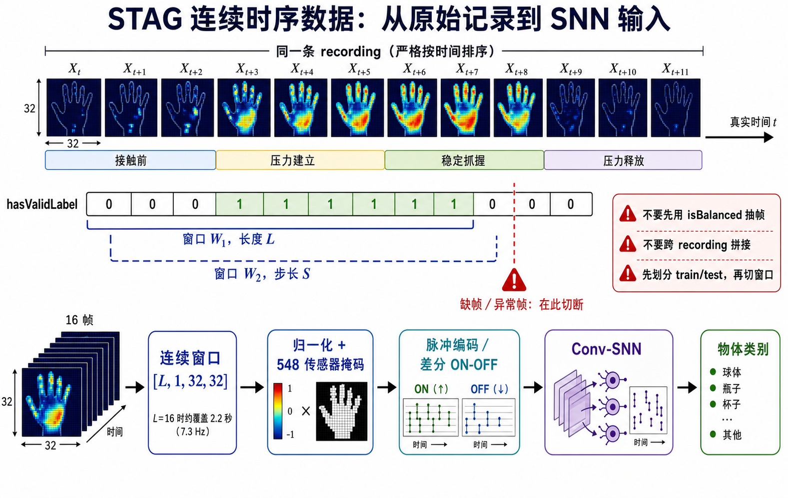

# STAG 时序信息数据构建

本文汇总 STAG 数据集用于连续时序分类和 SNN 建模时的重要数据组织原则。目标是把原始的逐帧触觉压力数据重新组织为：

$$
(X_t,X_{t+1},\ldots,X_{t+L-1})
\longrightarrow
\text{物体类别}
$$

其中每个触觉帧满足：

$$
X_t\in\mathbb{R}^{32\times32}
$$

连续窗口内部必须来自同一个 recording，并严格保持真实时间顺序。

## 1. STAG 数据的三种使用方式

### 1.1 单帧分类

$$
X_t\longrightarrow\text{物体类别}
$$

只利用某一时刻的空间压力分布，不使用帧间变化。

典型输入形状为：

```text
[batch, 1, 32, 32]
```

### 1.2 多帧集合分类

$$
\{X_{t_1},X_{t_2},\ldots,X_{t_N}\}
\longrightarrow
\text{物体类别}
$$

使用同一次抓握中的多张压力图，但这些帧可能是随机抽取的，模型不一定使用严格的时间顺序。

### 1.3 连续时序分类

$$
(X_t,X_{t+1},\ldots,X_{t+L-1})
\longrightarrow
\text{物体类别}
$$

连续时序分类保留真实帧顺序，可以学习：

- 从空手到接触物体的压力建立；
- 稳定抓握期间的空间压力变化；
- 手指和手掌之间的协同变化；
- 松手过程中压力逐渐释放的模式。

适用模型包括：

- 卷积 SNN；
- CNN-RNN、CNN-LSTM；
- 3D CNN；
- 时序 Transformer；
- 时空图神经网络。

## 2. 连续时序数据示意图



图中每个小方格表示一个 `32×32` 触觉帧。同一行的所有帧属于同一个 recording，并严格按照时间戳排序：

```text
接触前 → 压力建立 → 稳定抓握 → 压力释放
```

**`hasValidLabel` 用于表示每帧是否存在可靠物体接触。连续时序任务中应保留该字段作为接触状态，而不是先用它删除所有无接触帧。**

## 3. 最重要的数据组织原则

连续时序任务的数据单位不再是“独立帧”，而应改为：

```text
batch
└── recording
    └── 连续有效片段 chunk
        └── 接触片段 episode
            └── 时序窗口 window
```

完整流程为：

```text
读取原始数据
    ↓
按 (batchId, recordingId) 分组
    ↓
组内按时间戳和帧号排序
    ↓
先确定 train/test
    ↓
在缺帧、异常帧和时间跳跃处切断
    ↓
保留 hasValidLabel 作为接触状态
    ↓
识别接触片段或完整交互片段
    ↓
生成固定长度连续窗口
    ↓
归一化并应用 548 传感器掩码
    ↓
进行直接输入、脉冲编码或 ON/OFF 差分编码
```

## 4. 原始数据与关键字段

完整数据中，每段连续记录通常具有以下结构：

```text
[batch]/
└── [recording]/
    ├── pressuredata.mat
    ├── 000000.jpg
    ├── 000001.jpg
    ├── ...
    └── viz/
```

`pressuredata.mat` 主要包含：

- `data`：连续压力序列，目标形状为 `[T, 32, 32]`；
- `tStamp`：每帧时间戳；
- `frame`：原始帧编号。

也可以使用汇总后的 `metadata.mat`。连续时序构建所需的主要字段包括：

| 字段 | 用途 |
|---|---|
| `pressure` | `32×32` 触觉压力帧 |
| `batchId` | 采集批次编号 |
| `recordingId` | 连续记录编号 |
| `frame` | recording 内的原始帧号 |
| `ts` | 相对时间戳 |
| `objectId` | 物体类别 |
| `splitId` | 官方训练/测试划分 |
| `hasValidLabel` | 是否存在可靠物体接触 |
| `isBalanced` | 是否进入官方逐帧平衡子集 |
| `isTransition` | 空手到物体接触的过渡位置 |
| `isGrap` | 是否为可靠抓握状态 |

官方字段说明参见：

- [MIT STAG 分类数据说明](https://stag.csail.mit.edu/datasets/readme_classification.html)
- [MIT STAG 官方项目页](https://stag.csail.mit.edu/)

## 5. 为什么不能直接使用 `isBalanced`

官方逐帧分类实验使用 `isBalanced` 从每个类别中抽取相同数量的帧。该字段适合复现单帧分类，但不适合重建连续时序。

错误做法：

```python
frames = pressure[hasValidLabel & isBalanced]
```

问题包括：

1. `isBalanced` 选中的帧可能在时间上不相邻；
2. 连续帧之间可能缺少若干未被抽中的中间帧；
3. 模型看到的是离散压力图集合，而不是真实压力变化；
4. 删除无接触帧会丢失接触建立和释放阶段。

因此，对于连续时序任务：

- 不使用 `isBalanced` 选择时序帧；
- 不在重建时间轴之前使用 `hasValidLabel` 删除帧；
- `hasValidLabel` 应作为接触状态或辅助监督信号保留；
- 应从完整 recording 或原始 `pressuredata.mat` 构建时序。

## 6. 按 recording 重建时间轴

使用 `metadata.mat` 时，首先按照以下联合键分组：

```text
(batchId, recordingId)
```

然后在每个分组内部按照以下顺序排序：

```text
ts → frame
```

每条记录可以统一表示为：

```python
record = {
    "pressure":     ...,  # [T, 32, 32]
    "timestamp":    ...,  # [T]
    "frame_id":     ...,  # [T]
    "object_id":    ...,  # 标量或 [T]
    "contact":      ...,  # hasValidLabel, [T]
    "split":        ...,  # train/validation/test
    "batch_id":     ...,
    "recording_id": ...
}
```

需要检查：

```python
assert len(timestamp) == len(frame_id) == len(pressure)
assert np.all(np.diff(timestamp) >= 0)
assert len(np.unique(object_id)) == 1
assert len(np.unique(split_id)) == 1
```

如果同一 recording 内出现多个类别或多个数据集划分，应先检查元数据映射是否正确，不能直接生成窗口。

## 7. 必须先划分数据集，再生成窗口

正确顺序：

```text
recording 级划分 train/test
                  ↓
分别在各个划分中生成滑动窗口
```

错误顺序：

```text
生成所有重叠窗口
        ↓
按窗口随机划分 train/test
```

同一 recording 生成的相邻窗口通常高度相似。若窗口被随机分配到训练集和测试集，即使它们不是完全相同的窗口，也会导致明显的数据泄漏。

复现官方实验时，可以使用 `splitId` 确定训练集和测试集。

建议保存以下集合：

```text
train_recording_ids
test_recording_ids
```

并验证两者没有交集：

```python
assert train_ids.isdisjoint(test_ids)
assert validation_ids.isdisjoint(test_ids)
```

## 8. 检查真实时间连续性

MIT-STAG 的采样率约为 7.3 Hz，正常相邻帧时间间隔约为：

$$
\Delta t\approx\frac{1}{7.3}\approx0.137\text{ s}
$$

对于同一 recording，计算：

$$
\Delta t_i=ts_{i+1}-ts_i
$$

建议在以下位置切断序列：

- 帧编号不连续；
- 时间戳倒退或重复；
- 时间间隔明显大于正常值；
- 当前帧出现短路、饱和等异常；
- 物体类别发生变化；
- 跨越不同 recording 或 batch。

可用每条 recording 的时间间隔中位数作为参考：

```python
dt = np.diff(timestamp)
median_dt = np.median(dt[dt > 0])

time_break = (
    (dt <= 0)
    | (dt > 2.5 * median_dt)
    | (np.diff(frame_id) != 1)
)
```

原始压力帧中，大于约 950 的极端值可能来自电极短路。可以将其标记为异常帧：

```python
bad_frame = (pressure > 950).any(axis=(1, 2))
```

异常帧不应简单删除后再连接前后两帧。正确做法是在异常位置将 recording 切分为两个连续 chunk：

```text
正常片段 A │ 异常帧 │ 正常片段 B
```

A 和 B 分别生成窗口，窗口不得跨越异常断点。

## 9. 两种连续序列构建模式

### 9.1 稳定接触时序

只使用 `hasValidLabel=True` 的连续区间：

```text
False False True True True True False
            └──接触片段──┘
```

然后在每个连续接触片段内部切出长度为 $L$ 的窗口。

优点：

- 标签可靠；
- 建模简单；
- 容易与单帧分类结果比较；
- 适合作为第一版时序基线。

缺点：

- 丢失接触前阶段；
- 丢失压力建立初期；
- 丢失压力释放阶段。

### 9.2 完整交互时序

如果希望 SNN 学习压力建立和释放过程，应保留接触区间前后的帧：

```text
接触前       压力建立       稳定抓握       压力释放
──────┬──────────┬────────────┬──────────
False False True True True True True False False
```

设连续接触区间为 $[s,e]$，向前后扩展：

$$
[s-K_{\mathrm{pre}},e+K_{\mathrm{post}}]
$$

实现形式：

```python
start = max(chunk_start, contact_start - pre_frames)
end = min(chunk_end, contact_end + post_frames)
episode = pressure[start:end]
```

在 7.3 Hz 下：

| 扩展帧数 | 约对应时间 |
|---:|---:|
| 2 帧 | 0.27 秒 |
| 4 帧 | 0.55 秒 |
| 8 帧 | 1.10 秒 |

`hasValidLabel` 可能出现一两帧的短暂抖动。可以在同一 recording 内对长度不超过 1～2 帧的无接触间隔进行合并，但不能跨越异常断点或 recording 边界。

## 10. 固定长度滑动窗口

设窗口长度为 $L$、滑动步长为 $S$，第 $k$ 个窗口为：

$$
W_k=
(X_{kS},X_{kS+1},\ldots,X_{kS+L-1})
$$

代码形式：

```python
for start in range(0, len(sequence) - L + 1, stride):
    end = start + L
    window = sequence[start:end]
```

推荐首先测试：

| 窗口长度 | 在 7.3 Hz 下覆盖时间 |
|---:|---:|
| $L=8$ | 约 1.10 秒 |
| $L=16$ | 约 2.19 秒 |
| $L=32$ | 约 4.38 秒 |

可以使用 50% 重叠：

$$
S=L/2
$$

例如：

```text
L = 16
S = 8
```

窗口不得：

- 跨越不同 recording；
- 跨越不同 batch；
- 跨越不同物体；
- 跨越训练集和测试集；
- 跨越缺帧、异常帧或明显时间跳跃；
- 在删除若干中间帧后进行虚假拼接。

## 11. 窗口标签

若一条 recording 只对应一个物体，可以将窗口标签设为该 recording 的 `objectId`。但建议同时计算窗口的接触比例：

$$
r_{\mathrm{contact}}
=
\frac{1}{L}
\sum_{t=1}^{L}
\mathbf{1}[\text{hasValidLabel}_t]
$$

可根据任务定义标签：

```python
if contact_ratio >= object_threshold:
    label = object_id
elif contact_ratio == 0:
    label = empty_hand_id
else:
    label = ignore_or_transition
```

不同任务可以采用：

- 稳定抓握分类：`contact_ratio == 1.0`；
- 完整交互分类：`contact_ratio >= 0.25` 或 `0.5`；
- 空手分类：窗口中完全没有可靠接触；
- 过渡片段：忽略，或者定义额外 transition 类；
- 联合学习：同时预测物体类别和逐帧接触状态。

推荐的联合标签结构：

```python
sample = {
    "x":             window,          # [L, 1, 32, 32]
    "object_label":  object_id,       # 标量
    "contact_label": contact_window,  # [L]
}
```

## 12. 传感器掩码

STAG 每帧被组织成 `32×32` 矩阵，但只有 548 个位置对应真实传感器。其余位置是无效区域，不应被解释为真实的零压力传感器。

定义空间掩码：

$$
M_{i,j}=
\begin{cases}
1,&(i,j)\text{ 对应真实传感器}\\
0,&(i,j)\text{ 为无效位置}
\end{cases}
$$

对每个时间步应用：

$$
\widetilde{X}_t=X_t\odot M
$$

掩码形状建议为：

```text
[1, 32, 32]
```

在时间维上广播到：

```text
[L, 1, 32, 32]
```

## 13. 归一化

归一化统计量只能从训练 recording 计算，不能使用验证集或测试集。

### 13.1 固定范围归一化

用于接近官方处理时，可以将常用压力范围近似映射到 `[0,1]`：

$$
x'=
\operatorname{clip}
\left(
\frac{x-500}{650-500},
0,
1
\right)
$$

不能简单地把所有高于 650 的帧都当作异常。异常判断应结合原始数据分布和极端短路值。

### 13.2 逐传感器标准化

更稳健的方式是仅用训练集计算每个有效传感器的均值和标准差：

$$
x'_{t,i,j}
=
\frac{x_{t,i,j}-\mu^{\mathrm{train}}_{i,j}}
{\sigma^{\mathrm{train}}_{i,j}+\epsilon}
$$

注意：

- 无效矩阵位置不参与统计；
- 验证集和测试集使用训练集统计量；
- 标准化后再次应用有效传感器掩码；
- 所有窗口中保持相同处理方法。

## 14. SNN 输入编码

### 14.1 直接电流输入

将归一化压力作为每个 SNN 时间步的输入电流：

$$
X_t\longrightarrow I_t\longrightarrow\text{SNN state}_t
$$

这是最简单、最适合建立基线的方式。一个原始触觉帧对应一个 SNN 宏观时间步。

### 14.2 频率编码

压力越大，在一个内部仿真窗口中产生的脉冲越多：

$$
p(\text{spike})\propto X_t
$$

优点是与经典 SNN 输入形式兼容，缺点是会增加仿真时间和随机性。

### 14.3 首次脉冲延迟编码

压力越大，首次脉冲出现得越早：

$$
t_{\mathrm{spike}}\propto 1-X_t
$$

适合强调压力大小，但实现和训练稳定性需要单独验证。

### 14.4 压力差分 ON/OFF 编码

对相邻真实帧计算：

$$
D_t=X_t-X_{t-1}
$$

正负变化分别形成两个通道：

$$
E_t^{+}=\max(D_t,0)
$$

$$
E_t^{-}=\max(-D_t,0)
$$

其中：

- ON 通道表示压力增加；
- OFF 通道表示压力减小；
- 输入形状变为 `[L-1, 2, 32, 32]`；
- 更适合学习接触建立和压力释放；
- 第一帧绝对压力可以作为初始状态或额外通道。

对于连续抓握动力学，建议至少比较：

1. 归一化压力直接输入；
2. ON/OFF 差分输入；
3. 绝对压力与差分事件联合输入。

MIT-STAG 原始采样率约为 7.3 Hz。即使 SNN 内部运行更多仿真步，也不能恢复原始数据中不存在的毫秒级触觉信息。

## 15. 推荐的样本形状

原始连续压力窗口：

```text
[L, 1, 32, 32]
```

PyTorch DataLoader 组成批次后：

```text
[batch, L, 1, 32, 32]
```

部分 SNN 框架使用时间优先格式：

```text
[L, batch, 1, 32, 32]
```

ON/OFF 差分编码后：

```text
[L-1, batch, 2, 32, 32]
```

推荐每个 Dataset 样本返回：

```python
{
    "x":             FloatTensor[L, 1, 32, 32],
    "y":             LongTensor[],
    "contact":       BoolTensor[L],
    "time_mask":     BoolTensor[L],
    "sensor_mask":   BoolTensor[1, 32, 32],
    "timestamps":    FloatTensor[L],
    "recording_id":  str,
    "start_frame":   int,
}
```

固定长度窗口的 `time_mask` 全部为真。使用变长 episode 和 padding 时，`time_mask` 用于屏蔽补齐位置。

## 16. 推荐的磁盘组织结构

不建议将所有重叠窗口分别保存，因为这会重复存储大量相同帧。推荐保存完整 recording，再通过清单记录窗口位置：

```text
processed/
├── recordings/
│   ├── batch001_recording003.npy
│   ├── batch001_recording004.npy
│   └── ...
├── metadata/
│   ├── batch001_recording003.npz
│   └── ...
├── sensor_mask.npy
├── normalization_stats.npz
├── train_windows.csv
├── validation_windows.csv
└── test_windows.csv
```

每个 recording 的压力文件：

```text
shape = [T, 32, 32]
```

窗口清单示例：

```csv
split,batch_id,recording_id,start,length,object_id,contact_ratio
train,001,003,0,16,24,0.75
train,001,003,8,16,24,1.00
test,003,002,0,16,11,0.63
```

Dataset 根据清单动态读取：

```python
record = np.load(record_path)
window = record[start:start + length]
```

这种方式具有以下优点：

- 不重复保存重叠帧；
- 可以方便地改变 $L$ 和 $S$；
- 能追踪每个窗口来自哪个 recording；
- 容易检查训练测试泄漏；
- 同一份数据可以用于 SNN、RNN、3D CNN 和 Transformer。

## 17. 构建窗口的伪代码

```python
for record in all_recordings:
    # 1. recording 已在上游分配到 train/validation/test
    split = record.split

    # 2. 严格按时间排序
    order = lexsort(record.timestamp, record.frame_id)
    x = record.pressure[order]
    ts = record.timestamp[order]
    frame = record.frame_id[order]
    contact = record.contact[order]

    # 3. 检测异常帧和时间断点
    bad = detect_bad_pressure(x)
    breaks = detect_time_or_frame_gaps(ts, frame)

    # 4. 在断点处切成若干严格连续的 chunk
    chunks = split_into_continuous_chunks(
        x=x,
        ts=ts,
        frame=frame,
        contact=contact,
        bad=bad,
        breaks=breaks,
    )

    for chunk in chunks:
        # 5. 可选择稳定接触模式或完整交互模式
        episodes = build_contact_episodes(
            chunk,
            keep_pre_contact=True,
            keep_post_contact=True,
        )

        for episode in episodes:
            # 6. 在同一 episode 内生成连续窗口
            for start in range(0, len(episode) - L + 1, stride):
                end = start + L
                window = episode.pressure[start:end]
                contact_window = episode.contact[start:end]

                contact_ratio = contact_window.mean()
                label = assign_label(
                    object_id=record.object_id,
                    contact_ratio=contact_ratio,
                )

                # 7. 清单只保存索引与元数据
                save_manifest_row(
                    split=split,
                    recording_id=record.recording_id,
                    start=episode.global_start + start,
                    length=L,
                    label=label,
                    contact_ratio=contact_ratio,
                )
```

## 18. 数据增强注意事项

时序增强必须保持时间一致性。

合理的增强包括：

- 在所有时间步使用相同的传感器随机失活掩码；
- 对整个窗口统一添加小幅传感器噪声；
- 在不跨断点的条件下进行小范围时间起点抖动；
- 随机裁剪连续子窗口；
- 对整段序列统一进行幅值缩放。

需要避免：

- 独立打乱窗口内部帧顺序；
- 每一帧使用完全不同的随机空间掩码；
- 随机删除中间帧后直接连接；
- 将不同 recording 的帧混合；
- 将测试集统计量用于训练数据增强；
- 对手部矩阵随意水平或垂直翻转，因为其可能改变真实手部空间结构。

## 19. 推荐的第一版实验配置

建议先建立一个简单、可验证的连续时序基线：

```text
数据单位：recording
数据划分：官方 splitId，验证集按 recording 从训练集划分
序列模式：完整连续帧
窗口长度：L = 16
滑动步长：S = 8
窗口覆盖时间：约 2.2 秒
物体标签条件：contact_ratio ≥ 0.5
原始输入形状：[16, 1, 32, 32]
异常处理：缺帧或异常帧处切断
归一化：仅使用训练 recording 统计量
空间处理：应用 548 传感器掩码
SNN 基线：归一化压力直接作为输入电流
对照编码：压力差分 ON/OFF 双通道
对照模型：CNN-LSTM 或 3D CNN
```

建议依次进行以下实验：

1. 单帧 CNN/SNN；
2. 连续窗口 CNN-LSTM；
3. 连续窗口直接输入 Conv-SNN；
4. ON/OFF 差分编码 Conv-SNN；
5. 不同窗口长度 $L\in\{8,16,32\}$；
6. 稳定接触与完整交互两种序列模式对比。

## 20. 数据泄漏与正确性检查

生成数据集后至少检查以下条件：

### 20.1 划分无交集

```python
assert train_recording_ids.isdisjoint(test_recording_ids)
assert train_recording_ids.isdisjoint(validation_recording_ids)
assert validation_recording_ids.isdisjoint(test_recording_ids)
```

### 20.2 窗口严格连续

```python
assert np.all(np.diff(window.frame_id) == 1)
assert np.all(np.diff(window.timestamp) > 0)
```

若硬件偶尔丢帧导致帧号不严格加一，应至少验证时间差没有超过设定阈值。

### 20.3 标签一致

```python
assert len(np.unique(window.object_id)) == 1
assert len(np.unique(window.recording_id)) == 1
```

### 20.4 不跨异常断点

```python
assert not window.bad_frame.any()
assert window.max_time_gap <= allowed_gap
```

### 20.5 归一化无泄漏

- 均值、标准差、最小值和最大值只从训练集计算；
- 验证集和测试集只读取训练统计量；
- 测试 recording 不参与类别平衡、阈值选择和超参数选择。

### 20.6 数据统计报告

建议输出：

- 每个划分的 recording 数量；
- 每个类别的 recording 数量；
- 每个类别的窗口数量；
- 窗口接触比例分布；
- 每条 recording 的时间长度；
- 时间间隔分布；
- 异常帧和断点数量；
- 不同窗口之间的重叠比例。

如果某个类别只有很少的独立 recording，即使窗口数量很多，也不能认为该类别拥有大量独立样本。

## 21. 最终原则总结

STAG 连续时序数据构建可以概括为：

```text
以 recording 为基本单位
        ↓
严格按 ts 和 frame 排序
        ↓
先按 recording 划分 train/validation/test
        ↓
不使用 isBalanced 构建时间序列
        ↓
不先删除 hasValidLabel=False 的帧
        ↓
在缺帧、异常值和时间跳跃处切断
        ↓
从连续 chunk 中提取接触 episode
        ↓
生成长度 L、步长 S 的连续窗口
        ↓
使用训练集统计量归一化
        ↓
应用 548 传感器空间掩码
        ↓
输入 SNN 或其他时序模型
```

最关键的三条规则是：

1. **不能跨 recording 拼接帧。**
2. **必须先划分数据集，再生成滑动窗口。**
3. **不能使用官方 `isBalanced` 离散抽样结果冒充连续时间序列。**

只有满足这些条件，模型输入才是真正保留抓握压力建立、稳定和释放过程的 STAG 连续时序数据。
